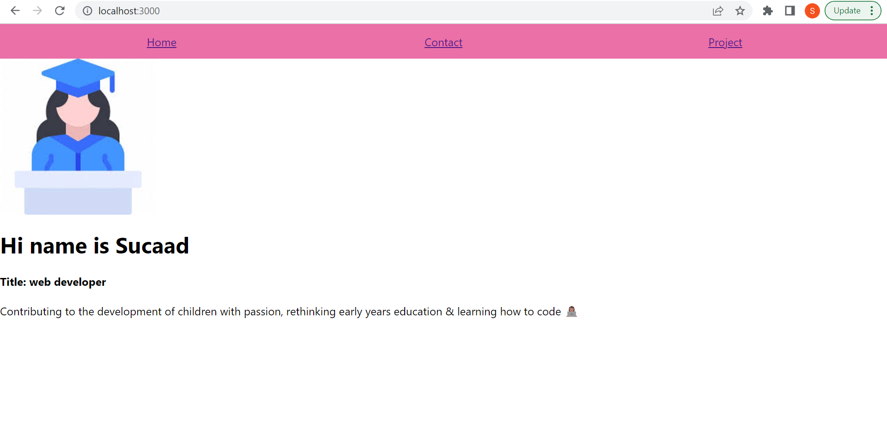
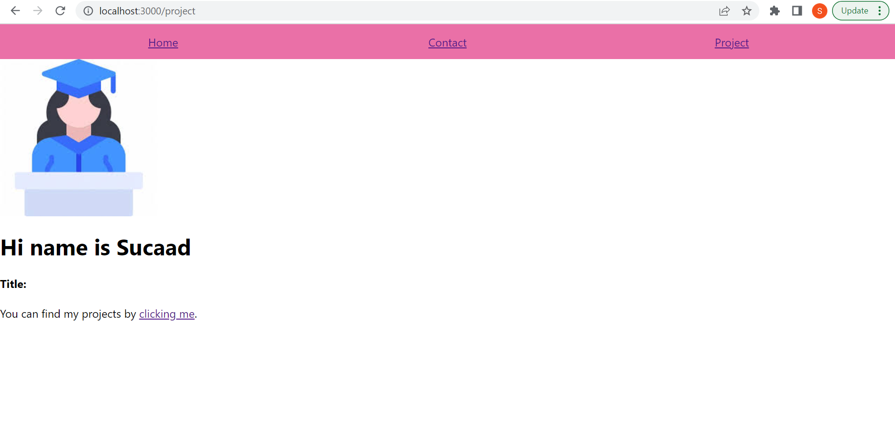
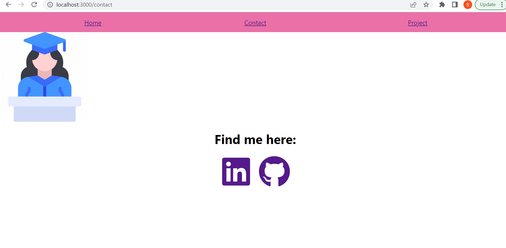

## React Portfolio
This is my personal portfolio, built using React. The portfolio contains information about me, my skills, and the projects I've worked on.

## Components
The following components are included in this portfolio:

App: The top-level component that renders the header and the pages.
Header: The header component that contains the navigation menu.
Home page: The landing page that showcases my personal information and skills.
Projects page: The page that displays my github page that leads to projects I've worked on.
Project: The component that displays details about a specific project.
Contact page: The page that contains ways to contact me

## Screenshot

## Depolyment

Here is the deployed page:
https://sucaad-kulane.github.io/sucaad-portfolio_v2/

